# MANUAL DE USUARIO — FILMATE

**Plataforma web de cartelera, reservas, dulcería y comunidad cinematográfica**

| Campo | Información |
|---|---|
| Código del documento | MU-FILMATE-USR-001 |
| Versión | 1.0 |
| Línea base documental | 20 de junio de 2026 |
| Curso | Gestión de la Configuración de Software |
| Tipo de entregable | Manual de usuario con evidencia visual |
| Estado | Versión para evaluación académica |
| Elaborado por | Equipo del proyecto FILMATE |
| Docente | Reyes Huaman, Anita Marlene |

> Este documento describe la versión observada del frontend de usuario FILMATE y sus flujos integrados.

# Control del documento

| Versión | Fecha | Descripción del cambio | Responsable |
|---|---|---|---|
| 0.1 | 20/06/2026 | Inventario funcional y planificación de capturas. | Equipo FILMATE |
| 0.9 | 20/06/2026 | Ejecución de 24 evidencias visuales y validación de flujos. | Equipo FILMATE |
| 1.0 | 20/06/2026 | Emisión del manual académico en Markdown, Word y PDF. | Equipo FILMATE |

> Criterio de configuración documental: este manual se identifica mediante el código MU-FILMATE-USR-001; la versión 1.0 queda asociada a la línea base visual del 20 de junio de 2026. Cualquier cambio en rutas, etiquetas, reglas de validación, pasos de compra o diseño de pantallas debe originar una nueva revisión del documento y la sustitución de las capturas afectadas.

# Contenido

- 1. Introducción, objetivo y alcance.
- 2. Descripción del sistema, perfiles y requisitos de uso.
- 3. Convenciones visuales y mapa de navegación.
- 4. Acceso, registro e inicio de sesión.
- 5. Cartelera, filtros y detalle de película.
- 6. Cines y ubicación de locales.
- 7. Reserva de función y selección de asientos.
- 8. Dulcería, pago, comprobante y QR.
- 9. Perfil social, búsqueda, seguimiento y edición.
- 10. Cierre de sesión, solución de problemas y seguridad.
- 11. Trazabilidad, criterios de aceptación y gestión del manual.
- 12. Glosario y guía rápida.

# 1. Introducción

## 1.1 Objetivo

Orientar al usuario final en el uso seguro y correcto de FILMATE, desde el acceso inicial hasta la obtención del ticket de compra y la administración del perfil social. Cada procedimiento incluye precondiciones, acciones, resultado esperado y evidencia visual.

## 1.2 Alcance

El manual cubre el frontend de usuario: inicio de sesión, modo invitado, registro, cartelera, filtros, detalle de películas, horarios, cines, selección de asientos, dulcería, verificación, pago, ticket QR, perfil social, búsqueda de usuarios, seguimiento, edición de perfil, favoritos y cierre de sesión.

No cubre la administración interna de películas, cines, salas, funciones, usuarios o transacciones; esas operaciones pertenecen al frontend administrativo y requieren un manual independiente.

## 1.3 Base de la evidencia

Las capturas se obtuvieron el 20 de junio de 2026 sobre la aplicación React/Vite del repositorio FILMATE_UserFrontend. Debido a que la carga SQL de referencia programaba funciones únicamente del 6 al 16 de junio de 2026, se utilizó un entorno de demostración local controlado con la misma estructura de datos y contratos de API para habilitar fechas vigentes, asientos, dulcería, compra y módulos sociales. No se utilizaron datos financieros reales.

# 2. Descripción general del sistema

FILMATE es una plataforma web orientada a clientes de cine. Integra consulta de cartelera, reserva de butacas, compra de productos de dulcería, emisión de comprobante con QR y una comunidad social de gustos cinematográficos.

## 2.1 Perfiles de acceso

| Perfil | Capacidades principales | Restricciones |
|---|---|---|
| Invitado | Consultar cartelera, detalle de películas, cines y dulcería. | No accede al módulo Social ni completa reservas asociadas a usuario. |
| Usuario registrado | Todas las funciones públicas, reserva, pago, ticket y perfil social. | Debe mantener una sesión válida y datos de contacto correctos. |

## 2.2 Requisitos mínimos

- Equipo de escritorio, portátil, tableta o teléfono con navegador moderno.
- Google Chrome, Microsoft Edge o Mozilla Firefox actualizado.
- Resolución recomendada de escritorio: 1366 × 768 o superior.
- Conexión de red estable con acceso al frontend y al servicio API.
- Correo electrónico válido para usuarios registrados.
- JavaScript y almacenamiento local habilitados en el navegador.
- Para descargar el ticket: permisos de descarga habilitados.

## 2.3 Datos solicitados al registrarse

| Campo | Obligatorio | Regla aplicada |
|---|---|---|
| Nombre completo | Sí | Solo letras y espacios. |
| Nombre de usuario | Sí | Entre 3 y 20 caracteres; letras, números y guion bajo. |
| Correo electrónico | Sí | Formato usuario@dominio. |
| Contraseña | Sí | Mínimo 6 caracteres. |
| Documento | Sí | Entre 8 y 15 caracteres alfanuméricos. |
| Teléfono | No | Entre 7 y 15 dígitos, sin letras. |

# 3. Convenciones y navegación

## 3.1 Convenciones visuales

| Elemento | Significado |
|---|---|
| Botón rojo | Acción principal sensible o cierre de sesión. |
| Botón azul | Acción de navegación, edición o selección. |
| Botón verde | Confirmación o avance de compra. |
| Mensaje rojo | Error de validación o imposibilidad de completar una operación. |
| Mensaje verde | Operación completada correctamente. |
| Asiento claro | Disponible para selección. |
| Asiento verde | Seleccionado por el usuario. |
| Asiento rojo | Ocupado o no disponible. |

## 3.2 Mapa de navegación

La cabecera permite desplazarse entre Cartelera, Cines, Dulcería y Social. El módulo Social aparece únicamente cuando la sesión corresponde a un usuario registrado. La ruta de compra sigue la secuencia:

> Cartelera → Detalle de película → Función → Asientos → Dulcería → Verificación → Pago → Ticket.

# 4. Acceso al sistema

## 4.1 Iniciar sesión con cuenta registrada

Precondición: el usuario debe disponer de una cuenta activa.

1. Abra la URL de FILMATE en el navegador.
2. Escriba el correo electrónico registrado.
3. Escriba la contraseña; el valor se oculta por seguridad.
4. Seleccione «Iniciar sesión» o presione Enter.
5. Espere el mensaje de éxito y la redirección automática a la cartelera.

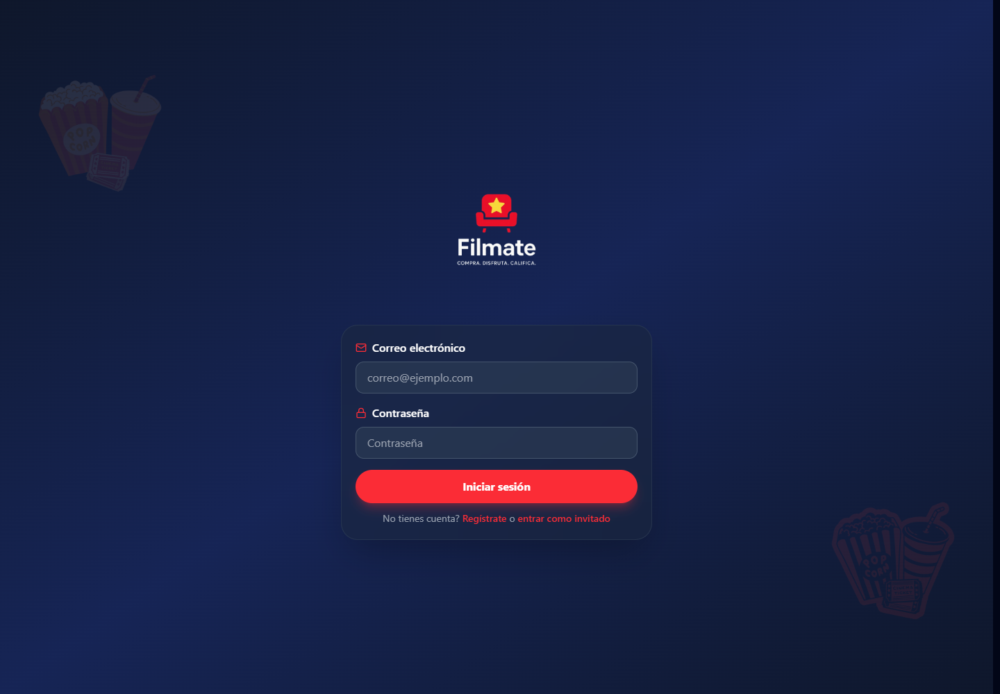

*Figura 1. Pantalla de inicio de sesión.*

Elementos y lectura de la pantalla:

- El campo de correo exige un formato que incluya el carácter @.
- La contraseña se muestra en modo oculto.
- El usuario puede ir al registro o entrar como invitado.

## 4.2 Validaciones de acceso

Si falta un dato, el correo no tiene formato válido o las credenciales no coinciden, FILMATE conserva al usuario en la pantalla y presenta un mensaje. Corrija el dato indicado y vuelva a intentar; no es necesario recargar la página.

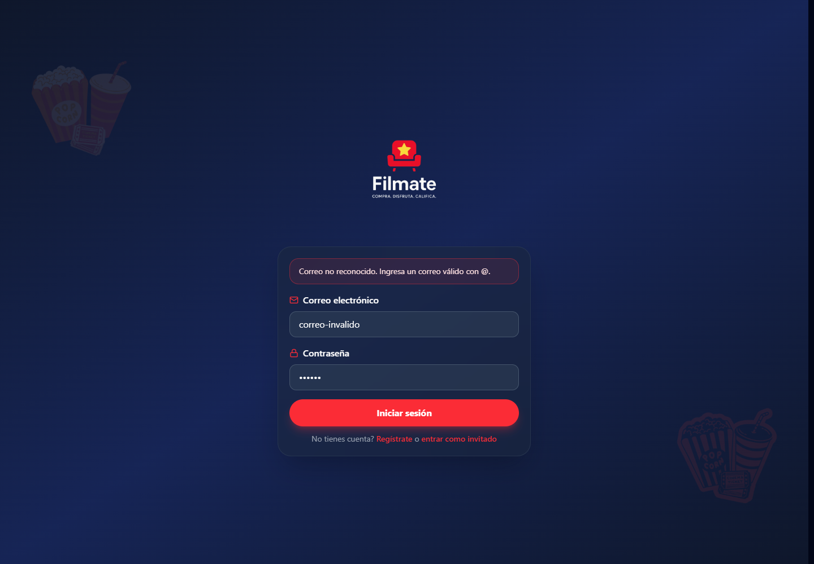

*Figura 2. Ejemplo de validación de correo.*

Elementos y lectura de la pantalla:

- El mensaje aparece encima de los campos.
- La validación evita enviar un correo sin formato válido al backend.

## 4.3 Entrar como invitado

1. En la pantalla de acceso, seleccione «entrar como invitado».
2. Espere la confirmación «Bienvenido, Invitado».
3. Consulte cartelera, cines y dulcería.
4. Para reservar o usar Social, cierre la sesión de invitado e ingrese con una cuenta registrada.

> El modo invitado es útil para exploración rápida, pero no debe emplearse para operaciones que necesiten identificar al comprador o conservar preferencias sociales.

# 5. Registro de usuario

## 5.1 Abrir el formulario

Desde el inicio de sesión, seleccione «Regístrate». El formulario organiza los datos en dos columnas en escritorio y en una sola columna en pantallas pequeñas.

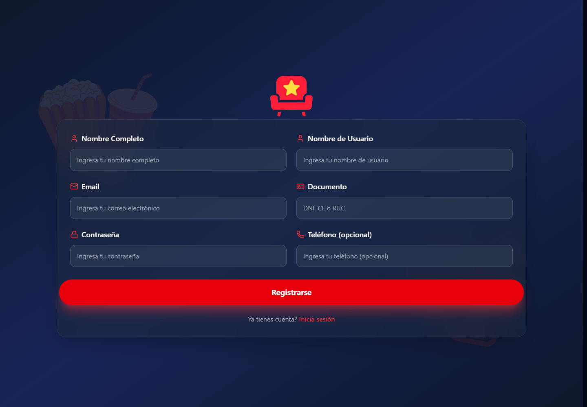

*Figura 3. Formulario de creación de cuenta.*

Elementos y lectura de la pantalla:

- La columna izquierda agrupa nombre, correo y contraseña.
- La columna derecha agrupa username, documento y teléfono.
- El teléfono es el único campo opcional.

## 5.2 Completar y enviar el registro

1. Ingrese el nombre completo sin números ni símbolos.
2. Defina un nombre de usuario único de 3 a 20 caracteres.
3. Ingrese un correo válido y una contraseña de al menos 6 caracteres.
4. Registre el documento entre 8 y 15 caracteres.
5. Opcionalmente, ingrese un teléfono de 7 a 15 dígitos.
6. Revise los datos y seleccione «Registrarse».
7. Espere el mensaje «Registro exitoso» y la redirección a la cartelera.

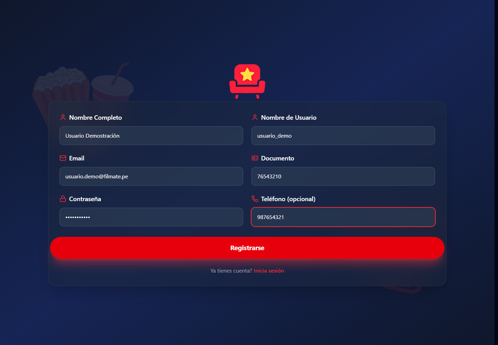

*Figura 4. Formulario diligenciado antes del envío.*

Elementos y lectura de la pantalla:

- Revise especialmente correo, documento y username porque identifican la cuenta.
- No comparta la contraseña ni utilice una clave de otro servicio.

## 5.3 Errores frecuentes de registro

| Mensaje o situación | Causa probable | Acción recomendada |
|---|---|---|
| Correo inválido | Falta @, dominio o extensión. | Corregir el formato del correo. |
| Username ya registrado | El nombre está en uso. | Probar una variante única. |
| Teléfono ya registrado | Duplicidad en el registro local o backend. | Verificar el número o usar otro. |
| Contraseña muy corta | Menos de 6 caracteres. | Definir una contraseña más larga. |
| Documento inválido | Longitud o caracteres no admitidos. | Usar 8 a 15 caracteres alfanuméricos. |
| No se pudo completar | API o red no disponible. | Esperar, comprobar conexión y reintentar. |

# 6. Cartelera

## 6.1 Consultar recomendaciones y películas

Después del acceso, la cartelera presenta recomendaciones destacadas, filtros y el catálogo disponible. Cada tarjeta incluye póster, título, género, duración, clasificación y valoración.

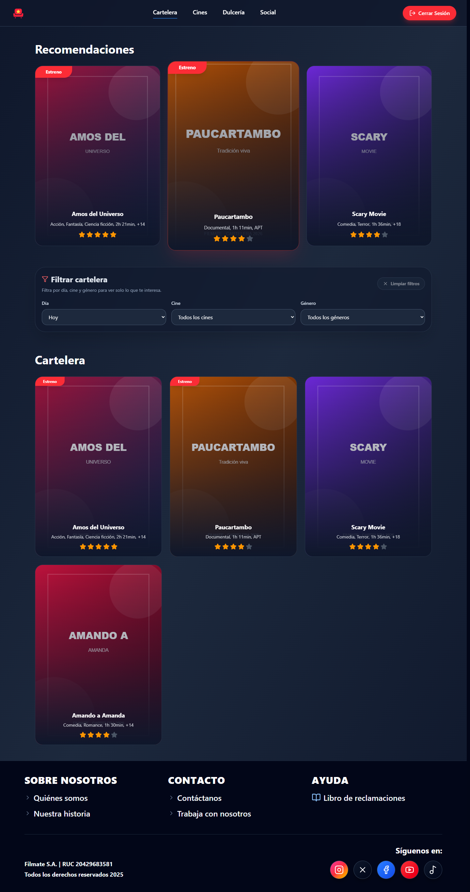

*Figura 5. Vista general de la cartelera.*

Elementos y lectura de la pantalla:

- La cabecera mantiene visibles las rutas principales y el cierre de sesión.
- Las recomendaciones aparecen primero.
- Los filtros preceden a la cuadrícula completa de cartelera.

## 6.2 Aplicar filtros

1. En «Filtrar cartelera», elija un día que tenga funciones.
2. Seleccione un cine específico o mantenga «Todos los cines».
3. Seleccione un género o mantenga «Todos los géneros».
4. Revise el resultado actualizado debajo del panel.
5. Use «Limpiar filtros» cuando exista al menos una selección distinta del valor general.

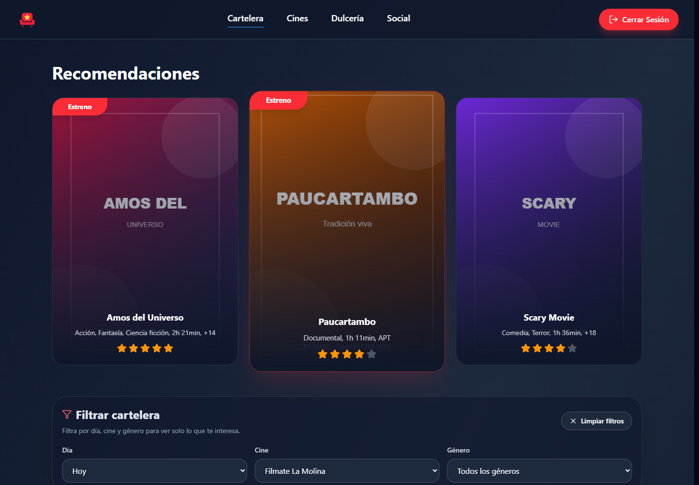

*Figura 6. Cartelera filtrada por sede.*

Elementos y lectura de la pantalla:

- Los filtros se combinan: día + cine + género.
- Si no hay coincidencias, cambie uno de los criterios.

## 6.3 Abrir el detalle de una película

1. Ubique la película en recomendaciones o cartelera.
2. Seleccione su tarjeta.
3. Revise título, géneros, clasificación, duración, sinopsis, dirección y reparto.
4. Consulte el tráiler y las reseñas disponibles.
5. Desplácese hasta los horarios por cine para iniciar una reserva.

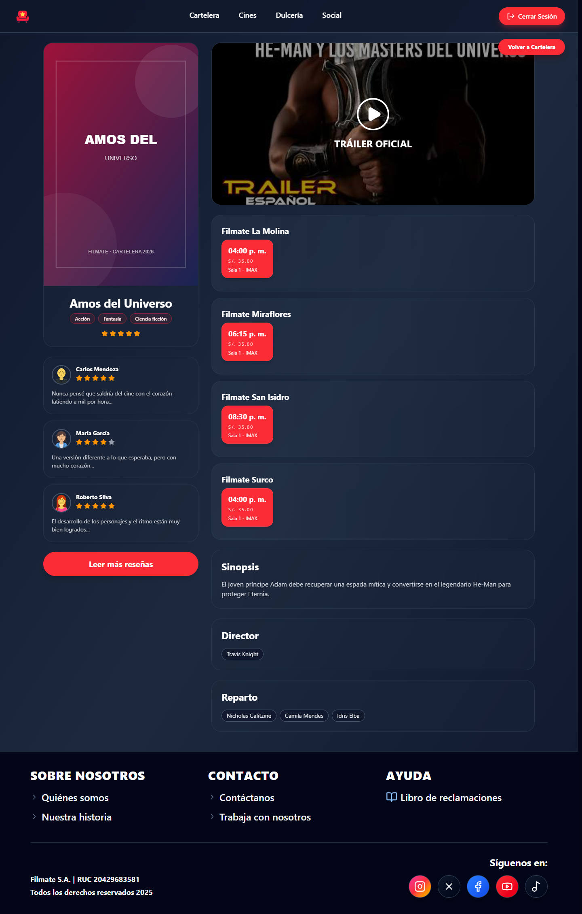

*Figura 7. Detalle completo de película.*

Elementos y lectura de la pantalla:

- La información proviene del catálogo configurado en el backend.
- El botón de regreso conserva el contexto de navegación.
- Los horarios se agrupan por sede.

## 6.4 Consultar horarios

Cada sede muestra las funciones de la fecha activa. La hora y sala deben verificarse antes de continuar, pues determinan el precio y el inventario de butacas.

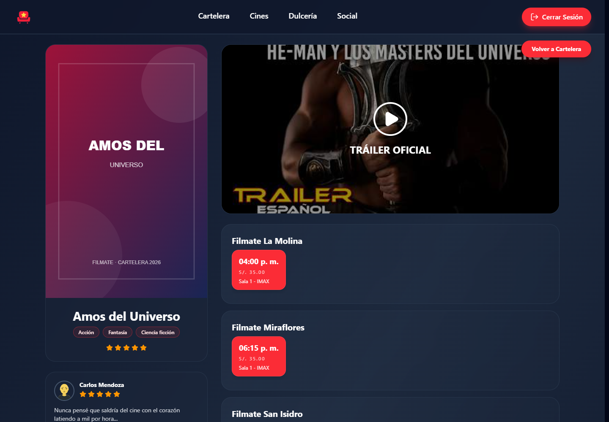

*Figura 8. Horarios disponibles por cine.*

Elementos y lectura de la pantalla:

- Seleccione exactamente la función que desea reservar.
- Si no aparecen horarios, pruebe otra película o fecha.

# 7. Cines

## 7.1 Consultar sedes

1. Seleccione «Cines» en la cabecera.
2. Revise nombre, dirección y horario de atención de cada sede.
3. Use el mapa embebido para reconocer la ubicación.
4. Seleccione «Ver en Google Maps» para ampliar la ubicación dentro de FILMATE.

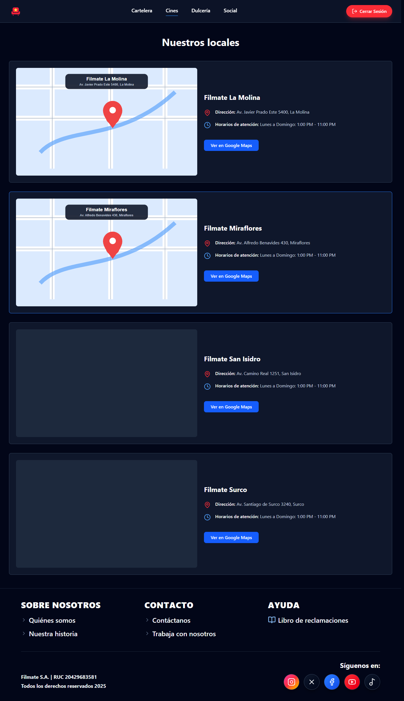

*Figura 9. Listado de locales FILMATE.*

Elementos y lectura de la pantalla:

- Cada tarjeta mantiene juntos mapa, dirección y horario.
- La disponibilidad de mapas externos depende de la conexión de red.

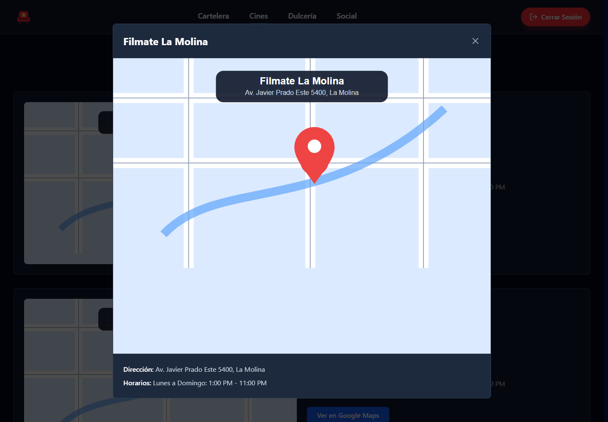

*Figura 10. Ampliación de la ubicación de una sede.*

Elementos y lectura de la pantalla:

- Cierre la ventana para volver al listado.
- Verifique la dirección textual si el mapa no carga.

# 8. Reserva de entradas

## 8.1 Precondiciones

- Sesión iniciada como usuario registrado.
- Película, fecha, sede y función seleccionadas.
- Mapa de asientos cargado.
- Conexión activa durante la selección y el pago.

## 8.2 Interpretar el mapa de asientos

La pantalla se ubica en la parte superior. Cada butaca muestra número y fila. El panel izquierdo resume película, cine, fecha, hora y sala. La disponibilidad puede cambiar si otro usuario reserva simultáneamente.

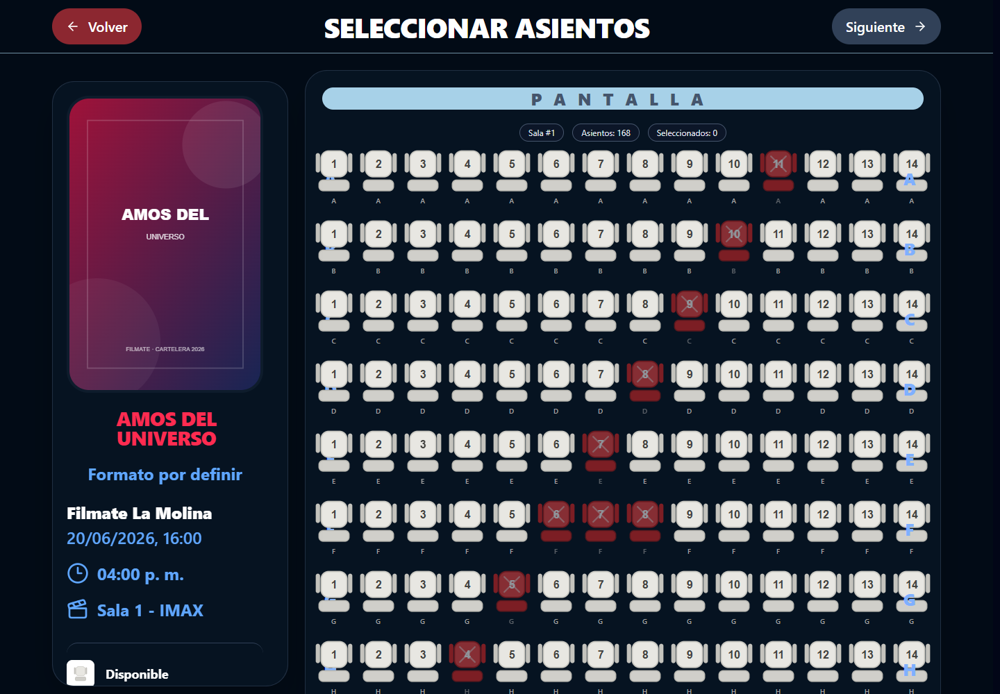

*Figura 11. Mapa de butacas antes de seleccionar.*

Elementos y lectura de la pantalla:

- Claro: asiento disponible.
- Rojo: asiento ocupado o bloqueado.
- El botón «Siguiente» permanece inactivo mientras no haya selección.

## 8.3 Seleccionar butacas

1. Seleccione una butaca clara.
2. Repita la acción para agregar más asientos.
3. Compruebe que las butacas elegidas cambien a color verde.
4. Para retirar una selección, vuelva a presionar la misma butaca.
5. Revise el contador de seleccionados y pulse «Siguiente».

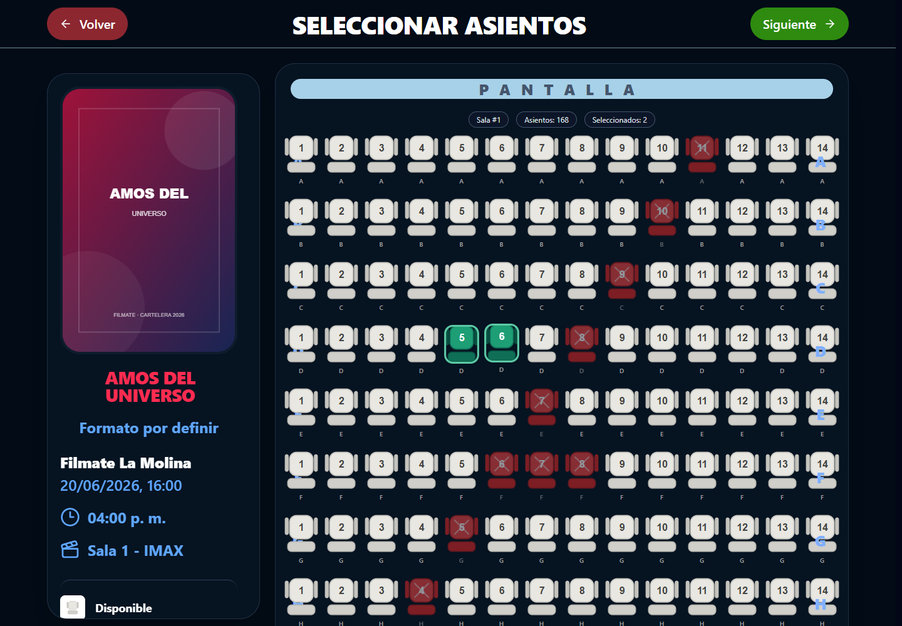

*Figura 12. Butacas D5 y D6 seleccionadas.*

Elementos y lectura de la pantalla:

- El color verde identifica temporalmente las butacas del usuario.
- No cierre la pestaña durante una selección activa.

## 8.4 Confirmar asientos y total

FILMATE presenta una confirmación con identificadores, cantidad y total de entradas. Use «Revisar» para volver al mapa o «Confirmar» para continuar a dulcería.

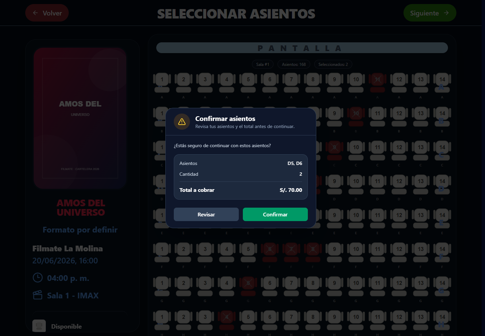

*Figura 13. Confirmación previa de butacas.*

Elementos y lectura de la pantalla:

- El total se calcula como cantidad de asientos por precio base de la función.
- Después de confirmar, conserve la misma sesión hasta obtener el ticket.

# 9. Dulcería y carrito

## 9.1 Flujo asociado a una reserva

La parte superior muestra la reserva seleccionada. El catálogo se organiza en Combos, Canchita, Bebidas y Dulces; el carrito permanece visible en escritorio.

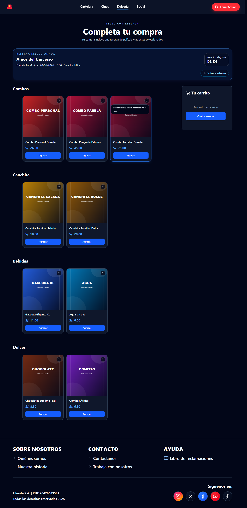

*Figura 14. Dulcería abierta desde una reserva.*

Elementos y lectura de la pantalla:

- «Volver a asientos» permite corregir la selección antes del pago.
- «Omitir snacks» continúa directamente con el importe de entradas.

## 9.2 Agregar productos

1. Seleccione «Agregar» en el producto deseado.
2. Use los botones + y − del carrito para ajustar la cantidad.
3. Compruebe los subtotales de asientos y snacks.
4. Use «Omitir snacks» si desea comprar solo entradas.
5. Seleccione «Confirmar pedido» cuando el resumen sea correcto.

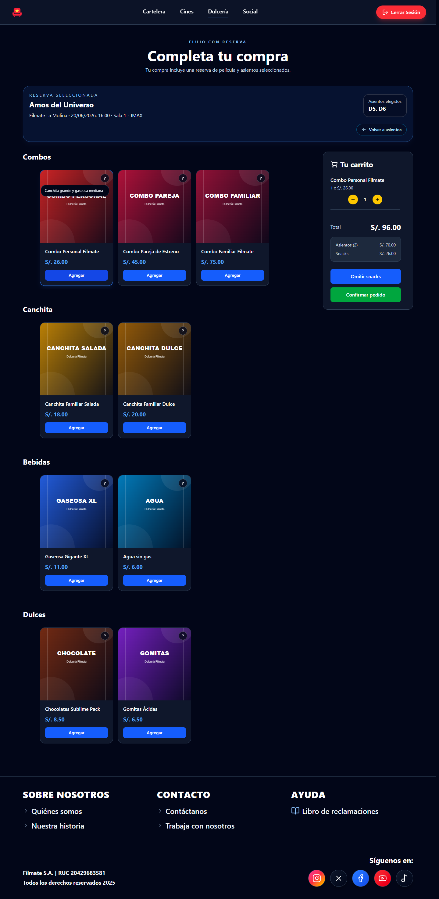

*Figura 15. Carrito con un combo agregado.*

Elementos y lectura de la pantalla:

- El total general combina entradas y productos.
- Una cantidad reducida a cero elimina el producto.

# 10. Verificación y pago

## 10.1 Verificar la compra

Antes de pagar, revise productos, cantidades, subtotal de snacks, subtotal de asientos y total. Seleccione «Cancelar pedido» para corregir o «Pagar ahora» para avanzar.

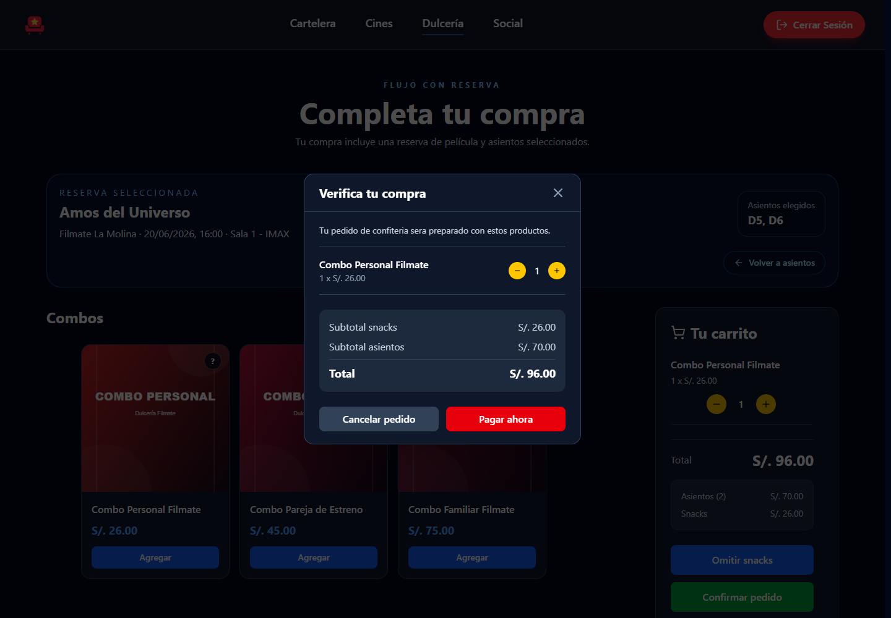

*Figura 16. Resumen de verificación.*

Elementos y lectura de la pantalla:

- Esta es la última revisión de cantidades antes de elegir el medio de pago.
- El usuario todavía puede regresar sin emitir la transacción.

## 10.2 Elegir método de pago

1. Revise el total a cobrar y los datos de película, sede, función y asientos.
2. Seleccione Tarjeta, Yape, Plin o Efectivo.
3. Compruebe el texto «Método seleccionado».
4. Pulse «Pagar con …».
5. No cierre ni actualice la página mientras aparezca «Procesando».

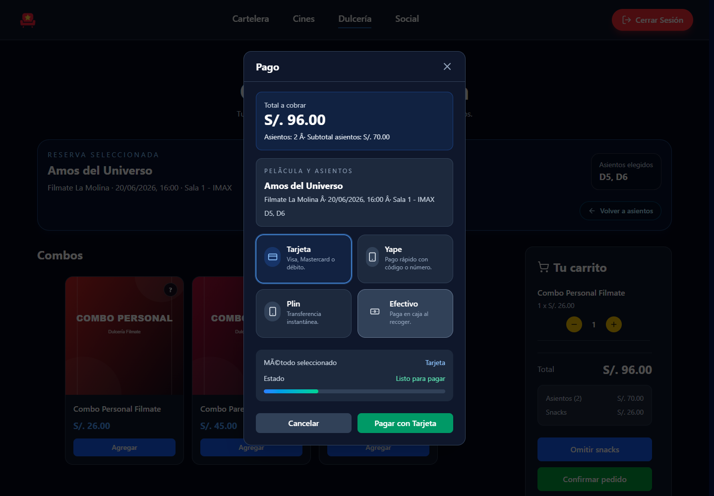

*Figura 17. Selección del método de pago.*

Elementos y lectura de la pantalla:

- El medio activo se resalta visualmente.
- En un entorno productivo, siga las instrucciones del proveedor de pago.

## 10.3 Resultado esperado del pago

La operación correcta genera un identificador de transacción, un número de pedido, el detalle del consumo, el total y un QR. Si aparece un error, no repita el pago inmediatamente: primero compruebe si ya existe una transacción.

# 11. Ticket y comprobante QR

1. Verifique película, sede, fecha, sala y asientos.
2. Verifique productos y total.
3. Conserve el número de pedido y el identificador de transacción.
4. Seleccione «Descargar PDF y salir» para guardar una copia.
5. Presente el QR en el punto de atención correspondiente.

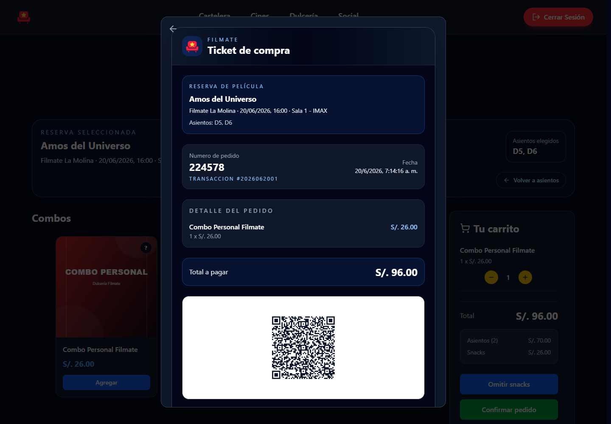

*Figura 18. Ticket de compra con QR.*

Elementos y lectura de la pantalla:

- El QR representa la transacción y no debe publicarse en redes sociales.
- La descarga genera un archivo PDF en la carpeta configurada por el navegador.
- El botón de regreso finaliza el flujo y vuelve a la cartelera.

> Recomendación de seguridad: trate el QR como un comprobante personal. Una captura compartida puede permitir que otra persona intente utilizar el pedido antes que el comprador.

# 12. Módulo Social

## 12.1 Consultar el perfil propio

El perfil presenta nombre, username, avatar, estadísticas, biografía, distribución personal de calificaciones y hasta cinco películas favoritas.

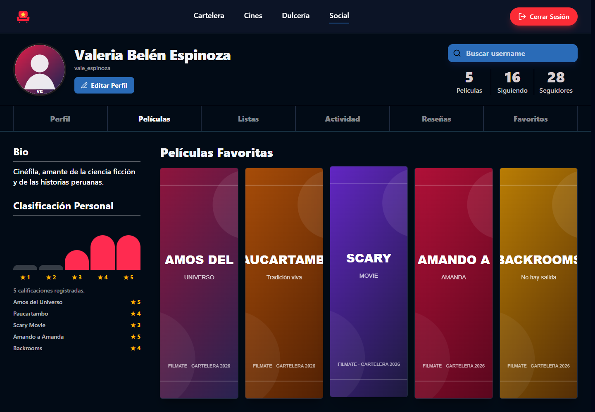

*Figura 19. Perfil social de usuario registrado.*

Elementos y lectura de la pantalla:

- Las estadísticas muestran películas, seguidos y seguidores.
- La clasificación personal resume las valoraciones por estrellas.
- «Editar Perfil» solo aparece en el perfil propio.

## 12.2 Buscar usuarios

1. Escriba al menos dos caracteres del username en «Buscar username».
2. Espere la lista de coincidencias.
3. Revise username y nombre del resultado.
4. Seleccione el usuario para abrir su perfil.

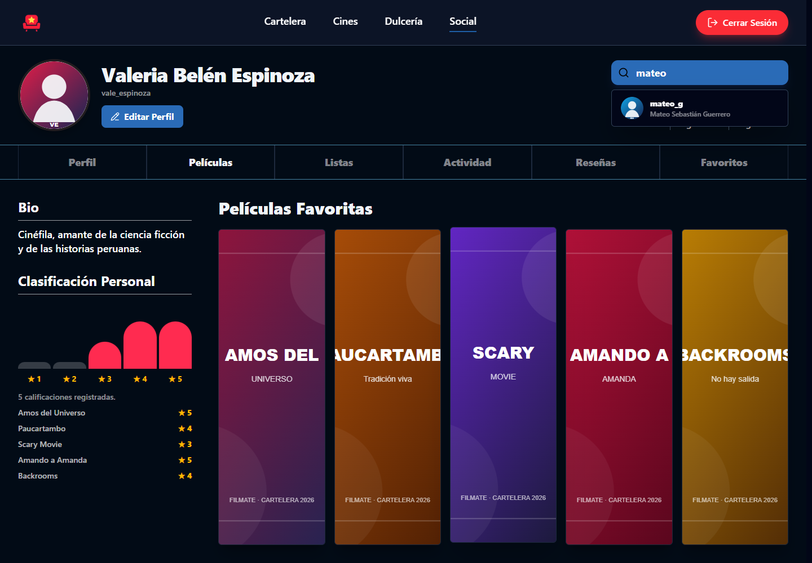

*Figura 20. Resultados de búsqueda social.*

Elementos y lectura de la pantalla:

- La búsqueda prioriza usernames que comienzan con el texto.
- Si no hay coincidencias, pruebe una parte diferente del username.

## 12.3 Seguir a otro usuario

1. Abra el perfil de otra persona desde la búsqueda.
2. Revise que no sea su propio perfil.
3. Seleccione «Seguir».
4. Espere que el botón cambie a «Siguiendo» y que aumente el contador.

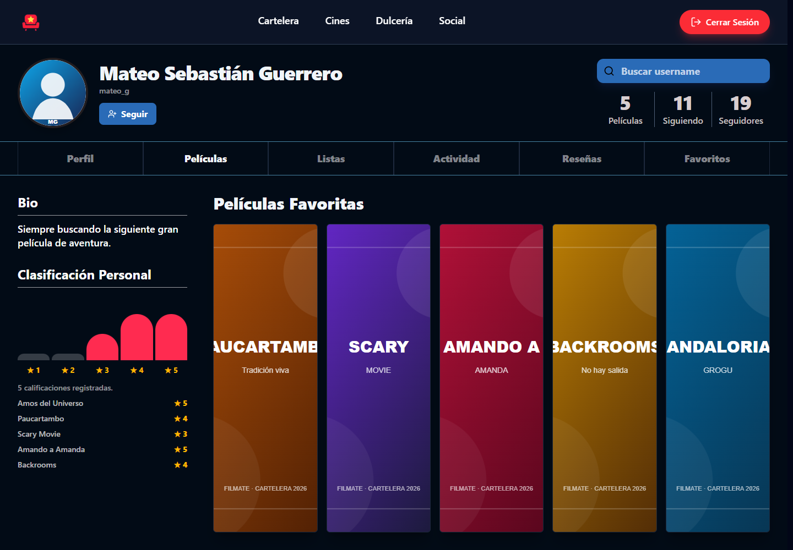

*Figura 21. Perfil de otro usuario con acción de seguimiento.*

Elementos y lectura de la pantalla:

- El botón «Seguir» sustituye a «Editar Perfil».
- La operación requiere una sesión registrada.

## 12.4 Editar información del perfil

1. En el perfil propio, seleccione «Editar Perfil».
2. Pulse «Modificar» para habilitar nombre, username, correo, teléfono, bio y avatar.
3. Realice los cambios necesarios.
4. Use «Cambiar avatar» para elegir una imagen propuesta.
5. Seleccione «Guardar cambios» y espere la confirmación.

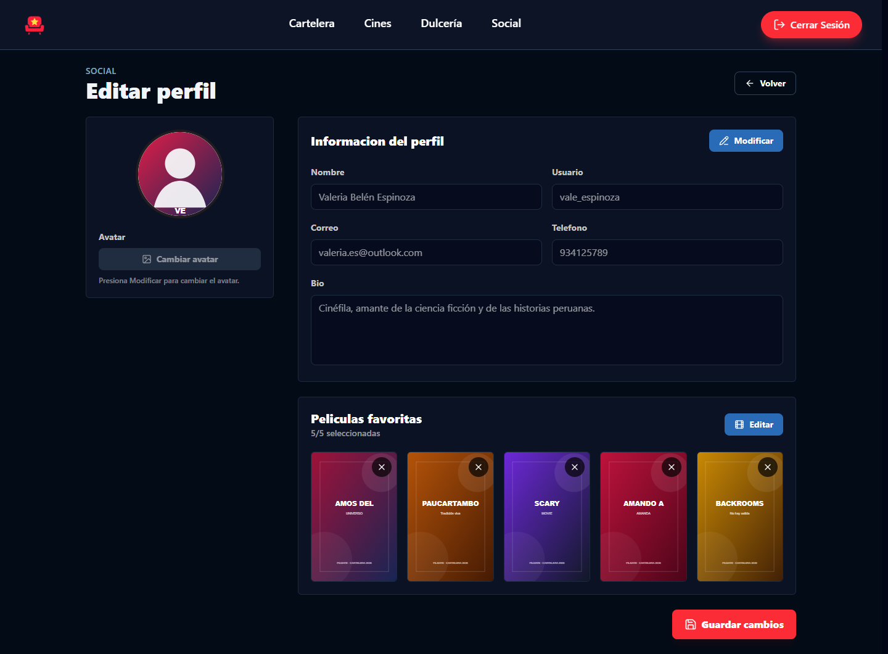

*Figura 22. Pantalla de edición del perfil.*

Elementos y lectura de la pantalla:

- Los campos están bloqueados hasta seleccionar «Modificar».
- La bio se presenta públicamente en el perfil social.
- El cambio de correo debe realizarse con especial cuidado.

## 12.5 Administrar películas favoritas

1. En «Películas favoritas», seleccione «Editar».
2. Busque una película por título si es necesario.
3. Seleccione o deseleccione tarjetas; el máximo es cinco.
4. Pulse «Aplicar selección».
5. Finalmente, seleccione «Guardar cambios» en la pantalla de edición.

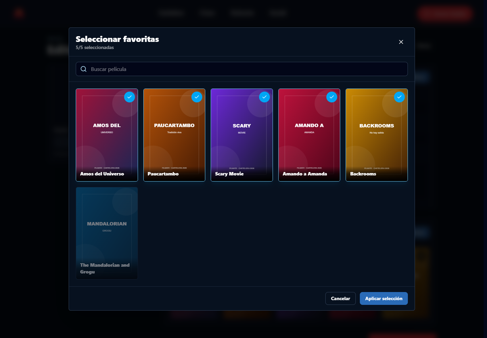

*Figura 23. Selector de películas favoritas.*

Elementos y lectura de la pantalla:

- El contador superior indica cuántas de cinco están seleccionadas.
- Una marca azul identifica cada favorita.
- Al alcanzar cinco, las películas restantes quedan deshabilitadas hasta retirar una.

# 13. Cerrar sesión

1. Seleccione «Cerrar Sesión» en la cabecera.
2. Revise el mensaje de confirmación.
3. Pulse «Cancelar» para continuar o «Cerrar Sesión» para finalizar.
4. Compruebe que el sistema vuelva a la pantalla de acceso.

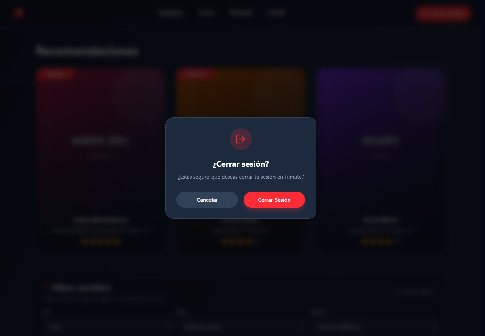

*Figura 24. Confirmación de cierre de sesión.*

Elementos y lectura de la pantalla:

- El cierre elimina la sesión almacenada en el navegador.
- En equipos compartidos, cierre siempre la sesión al terminar.

# 14. Solución de problemas

| Problema | Causa probable | Solución del usuario |
|---|---|---|
| No cargan películas | Backend no disponible o red interrumpida. | Comprobar conexión, esperar y recargar una vez. |
| No aparecen días con funciones | No existe programación vigente. | Consultar otra fecha o informar al administrador. |
| No aparece el mapa de asientos | La función no tiene inventario o falló la API. | Volver y elegir otra función; reintentar después. |
| Un asiento cambia a ocupado | Otro usuario lo reservó simultáneamente. | Seleccionar otra butaca disponible. |
| No se puede pagar | Sesión de invitado, datos incompletos o error de red. | Iniciar sesión, verificar reserva y reintentar una sola vez. |
| No se descarga el PDF | Descargas bloqueadas por el navegador. | Autorizar descargas y volver a usar el botón. |
| Social redirige al inicio | No existe sesión registrada. | Iniciar sesión con una cuenta activa. |
| Avatar o mapa no cargan | Recurso externo inaccesible. | Verificar internet; el resto de datos sigue disponible. |
| Texto o botones se superponen | Zoom o resolución extrema. | Restablecer zoom al 100 % y usar una resolución recomendada. |

## 14.1 Qué hacer ante un pago incierto

1. No presione repetidamente el botón de pago.
2. Revise si apareció número de pedido o transacción.
3. Conserve la hora, usuario, película, sede y total.
4. Consulte el historial disponible o contacte soporte antes de intentar de nuevo.
5. No comparta datos completos de tarjeta ni el QR con soporte informal.

# 15. Seguridad, privacidad y buenas prácticas

- Use una contraseña exclusiva y no la comparta.
- Compruebe la URL antes de ingresar credenciales.
- Cierre sesión en equipos públicos o compartidos.
- No publique tickets, QR, documentos, correo o teléfono.
- Revise el total antes de confirmar el pago.
- Evite actualizar o retroceder mientras se procesa una transacción.
- Mantenga el navegador actualizado.
- Reporte mensajes inesperados, cobros duplicados o cambios de perfil no autorizados.

# 16. Criterios de aceptación del usuario

| ID | Criterio verificable | Evidencia |
|---|---|---|
| CA-01 | El usuario puede iniciar sesión o recibir una validación comprensible. | Figuras 1 y 2 |
| CA-02 | El usuario puede registrar una cuenta con reglas visibles. | Figuras 3 y 4 |
| CA-03 | La cartelera lista y filtra películas. | Figuras 5 y 6 |
| CA-04 | El detalle muestra información y funciones por cine. | Figuras 7 y 8 |
| CA-05 | El usuario puede seleccionar y confirmar asientos. | Figuras 9, 10 y 11 |
| CA-06 | La dulcería permite agregar productos y calcular totales. | Figuras 12 y 13 |
| CA-07 | La compra se verifica, paga y genera ticket QR. | Figuras 14, 15 y 16 |
| CA-08 | El usuario consulta sedes y mapas. | Figuras 17 y 18 |
| CA-09 | El perfil social muestra estadísticas y favoritos. | Figura 19 |
| CA-10 | El usuario busca y sigue otros perfiles. | Figuras 20 y 21 |
| CA-11 | El usuario edita su perfil y favoritas. | Figuras 22 y 23 |
| CA-12 | El usuario puede cerrar su sesión de forma confirmada. | Figura 24 |

# 17. Gestión de configuración del manual

Para el curso de Gestión de la Configuración de Software, este manual se considera un elemento de configuración documental relacionado con el frontend, el contrato API y la línea base de datos de demostración.

## 17.1 Elementos bajo control

| Elemento | Identificador / ubicación | Disparador de actualización |
|---|---|---|
| Manual editable | docs/manual-usuario/Manual_de_Usuario_FILMATE.docx | Cambio funcional o corrección aprobada. |
| Manual portable | docs/manual-usuario/Manual_de_Usuario_FILMATE.pdf | Nueva versión del manual editable. |
| Fuente trazable | docs/manual-usuario/Manual_de_Usuario_FILMATE.md | Cambio de contenido o estructura. |
| Evidencias | docs/manual-usuario/capturas/*.png | Cambio visual, etiqueta, ruta o resultado. |
| Automatización | scripts/manual/capture-screenshots.mjs | Cambio de selectores o flujo. |
| Entorno de evidencia | scripts/manual/mock-server.mjs | Cambio de contrato de API o datos necesarios. |

## 17.2 Procedimiento de cambio

1. Registrar la solicitud de cambio y el motivo.
2. Identificar requisitos, pantallas y procedimientos afectados.
3. Actualizar la aplicación o el contrato API correspondiente.
4. Ejecutar nuevamente las capturas afectadas.
5. Actualizar contenido, control de versiones y matriz de trazabilidad.
6. Revisar ortografía, consistencia, enlaces e imágenes.
7. Generar Word y PDF desde la fuente.
8. Aprobar y etiquetar la nueva línea base documental.

## 17.3 Nomenclatura de versiones

Se recomienda usar versión mayor cuando cambia el flujo o alcance del manual; versión menor cuando se agregan funciones compatibles; y revisión de parche cuando solo se corrigen redacción, formato o capturas sin cambiar el procedimiento.

# 18. Glosario

| Término | Definición |
|---|---|
| API | Servicio que comunica el frontend con datos y operaciones del sistema. |
| Cartelera | Conjunto de películas con funciones disponibles. |
| Función | Exhibición de una película en fecha, hora, cine y sala determinados. |
| Butaca / asiento | Lugar individual que puede reservarse para una función. |
| Bloqueo temporal | Reserva breve de un asiento mientras el usuario completa la compra. |
| Dulcería | Catálogo de combos, canchita, bebidas y dulces. |
| QR | Código gráfico asociado al ticket o transacción. |
| Username | Nombre público y único utilizado en el módulo Social. |
| Línea base | Versión aprobada y controlada de software, datos o documentación. |
| Elemento de configuración | Activo sujeto a identificación, versión, cambio y auditoría. |

# 19. Guía rápida

> Comprar entradas: Iniciar sesión → Cartelera → Película → Horario → Asientos → Confirmar → Agregar u omitir snacks → Verificar → Elegir pago → Pagar → Descargar ticket.

> Actualizar perfil: Social → Editar Perfil → Modificar → Cambiar datos/avatar → Editar favoritas → Aplicar selección → Guardar cambios.

# 20. Verificación de integridad del entregable

- La portada identifica el curso, la docente, la versión y la línea base documental.
- El PDF contiene las 24 figuras correspondientes a los flujos documentados.
- El archivo DOCX conserva el contenido editable y la paginación.
- El documento no incluye contraseñas reales ni datos financieros sensibles.
- Los archivos fuente y las evidencias visuales permanecen versionados en el repositorio.
